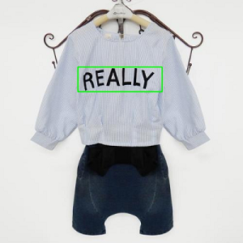

# 目录结构
* data文件夹下为用于演示的图片，还有用于测试的tfrecords文件
* model文件夹为CRNN神经网络的核心代码
* run文件夹为生成tfrecords文件、训练模型、测试模型、演示模型用的代码
* save文件夹为预先训练好的模型
* 经过验证python2, python3均可以运行

# 运行
* 首先按下面语句安装依赖
> pip -r requirements.txt

* 使用如下语句将图片转化为tfrecords，这将生成train.tfrecords，如果指定的text为test.txt，则生成test.tfrecords
> python -m run.im2fea --text data/icdar13/train/train.txt --save_dir data/icdar13

* 使用如下语句训练
> python -m run.train --dataset_dir data/icdar13/

* 使用如下语句测试
> python -m run.test --weights_path save/crnn_2018-02-05-03-11-05.ckpt-33600 --dataset_dir data/icdar13/

* 使用如下语句演示样例图片，这会用红色输出"savers"
> python -m run.demo --dataset_dir data/demo/3.jpg --weights_path save/crnn_2018-02-05-03-11-05.ckpt-33600

textbox 识别如下图所示：

